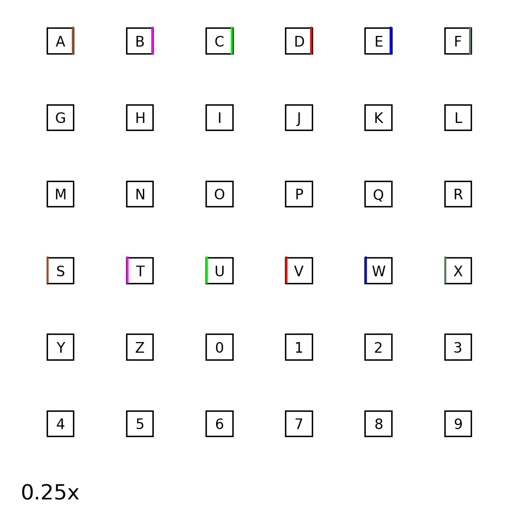

## Dual-directional visual motion based BCI Speller
Code for uni- and dual-directional visual motion based BCI spellers, as described in the original paper: 
[*Doubling the speed of N200 speller by dual-directional motion Encoding*](). 
Note that the original code is in the release [Version 0.1.1](../../releases/tag/0.1.1) 

### Quickstart
This repository requires python3.6 and Windows platform. If you have [Conda](https://anaconda.org):
```bash
    conda create -n py36 python=3.6
```

Activate the virtual env and install the dependencies from PyPI:  
```bash
    conda activate py36
    pip3 install -r requirements.txt
```

To test the *[Psychopy](https://www.psychopy.org/)* setup, run *OnlineSystem.py* with the debug config *./tests/test_stimulator.yml*.
```bash
    python3 OnlineSystem.py --cfg ./tests/test_stimulator.yml
```

To reproduce the major results reported in the paper, download the data from this [link](https://drive.google.com/open?id=1KhsIW-D_Rl6g0l3u2FXpzeZfSxK-fmJI), decompress and put it under the data directory. Then
simply run the notebook *figs_offline.ipynb*.

If you would like to run your own online experiments, you could either use *NeusanW (Neuracle Inc.)* 
with the interface provided by us or implement your own interface (including online data transmission and offline data loader) 
following the instructions in *Online/README.md*. 

### N200 Interface
#### The dual-directional speller
  

#### The uni-directional speller
  


### Experiment setup
1. Setup the hardware.
2. Write a config file for your subject referring to the examples in *config/*.
3. Run *OnlineSystem.py* to collect training data. (Note that the script **do not** collect data, so keep it in mind to record manually.)
    ```bash
       python3 OnlineSystem.py --cfg your/config/file 
    ```
4. Copy the data to the just generated path "*./data/(subject)/(YY-MM-DD-HH-MM-SS)*".
5. Run *training.py* to train the model.
    ```bash
       python3 training.py --cfg your/config/file 
    ```
6. Run *OnlineSystem.py* again for online experiments.
    ```bash
       python3 OnlineSystem.py --cfg your/config/file -t -d YY-MM-DD-HH-MM-SS  
       # -d takes the time of offline data with the form "YY-MM-DD-HH-MM-SS" 
       #   as the input.
    ```
Note: After running the *OnlineSystem.py*, press "S" to start and "Q" to quit the process.

### Support
If you have a question or feedback, or find any problems, you can contact us by [email](mailto:liudkun15@gmail.com) or open an issue on GitHub.
